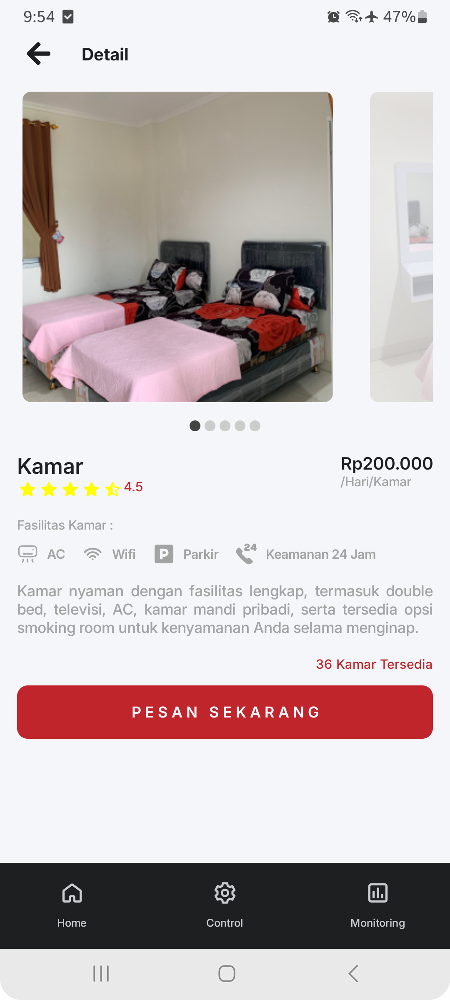
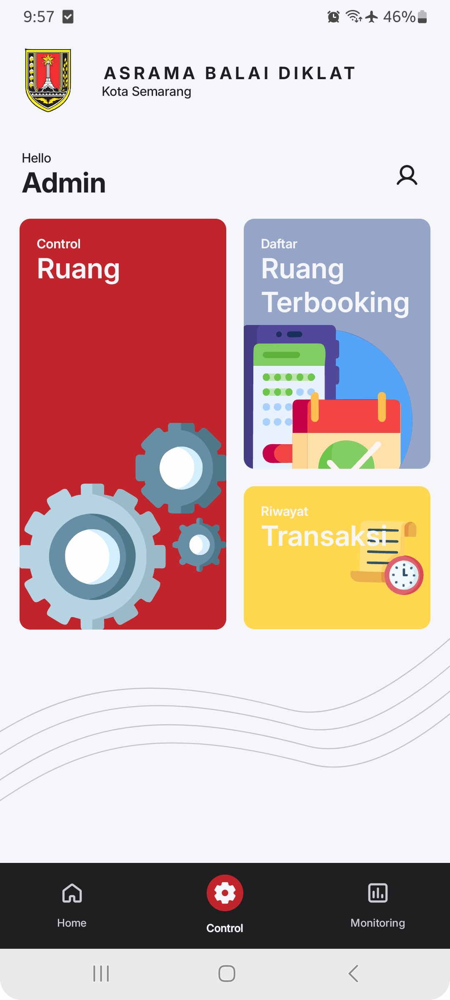
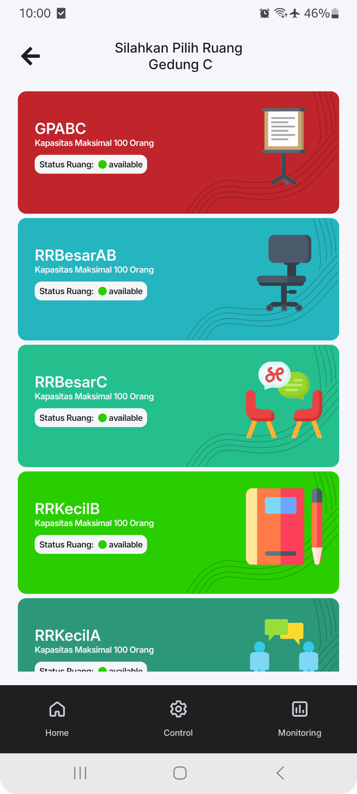

# 📱 Diklatku (Aplikasi Monitoring Penyewaan Balai Diklat BKPP Kota Semarang)

Aplikasi mobile untuk melakukan **monitoring dan penyewaan ruang pada balai diklat kota semarang**.
Aplikasi ditujukan untuk admin pengelola balai diklat dan masyarakat yang ingin menyewa ruang pada balai diklat.
Dibangun dengan **Kotlin** dan **ExpressJS backend**.

---

## 🚀 Features
- Monitoring ketersediaan ruang pada balai diklat
- Mengelola status ruang
- Melakukan penyewaan ruang
- Melihat riwayat penggunaan ruang

---

## 🖼️ Screenshot
<p align="center">
  
  
  
</p>

---

## 🎥 Demo Video
<p align="center">
  <a href="https://drive.google.com/file/d/1SVyz6IUAEB9sLoyLphEYRExWru6Yuwsi/view?usp=sharing" target="_blank">
    
  </a>
</p>

---

## ⚙️ Tech Stack
- **Frontend (Mobile)**: Kotlin + Jetpack Compose( Hilt, Retrofit, Paging3, MVVM)
- **Backend**: ExpressJS
- **Database**: MySQL

---

## 📦 Installation
```bash
# Clone repository
git clone https://github.com/AhmadSholehU/Reservation-app.git

# Masuk ke folder project
cd Reservation-app
```

---

## 👨‍💻 Author
- [Hendi Ahmad](https://github.com/AhmadSholehU)
